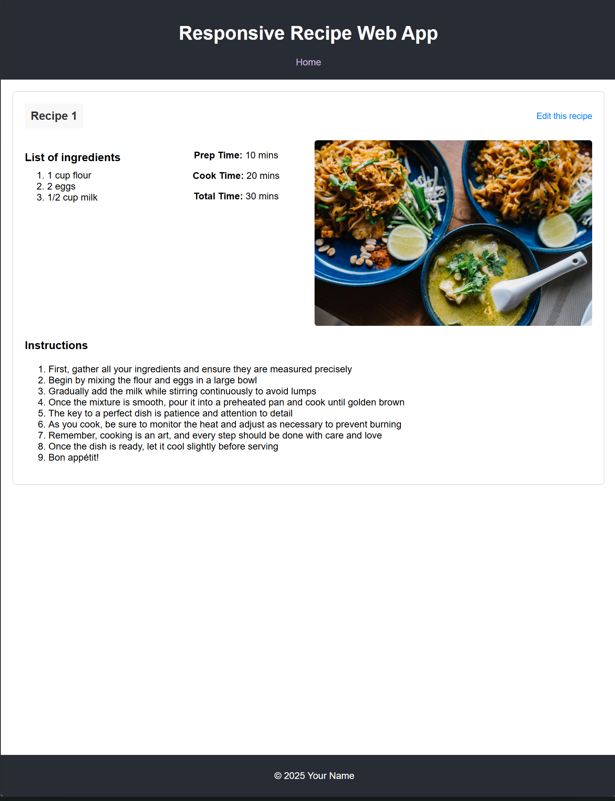
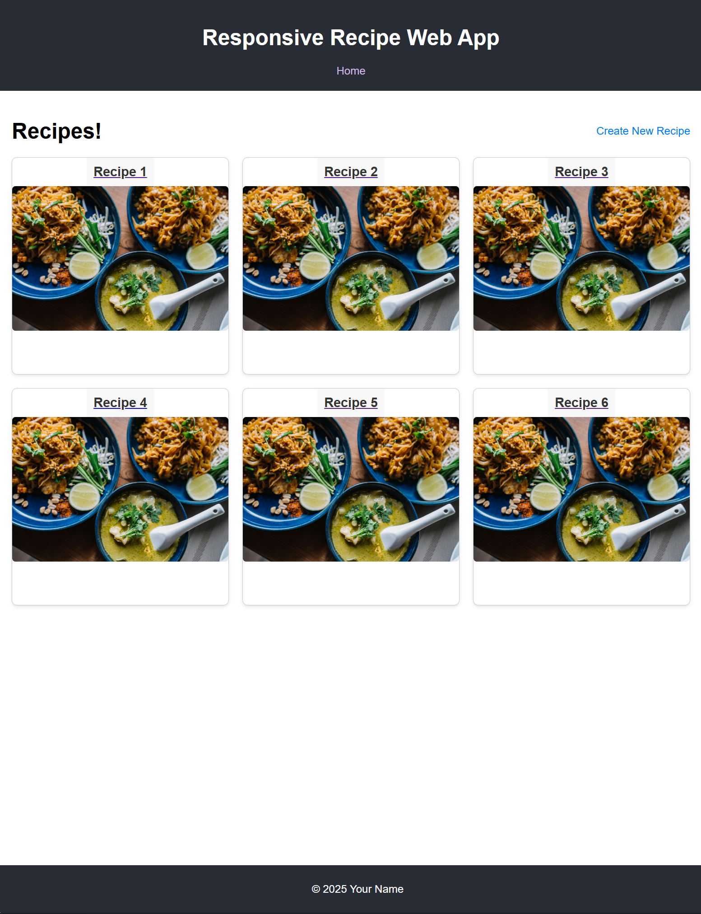
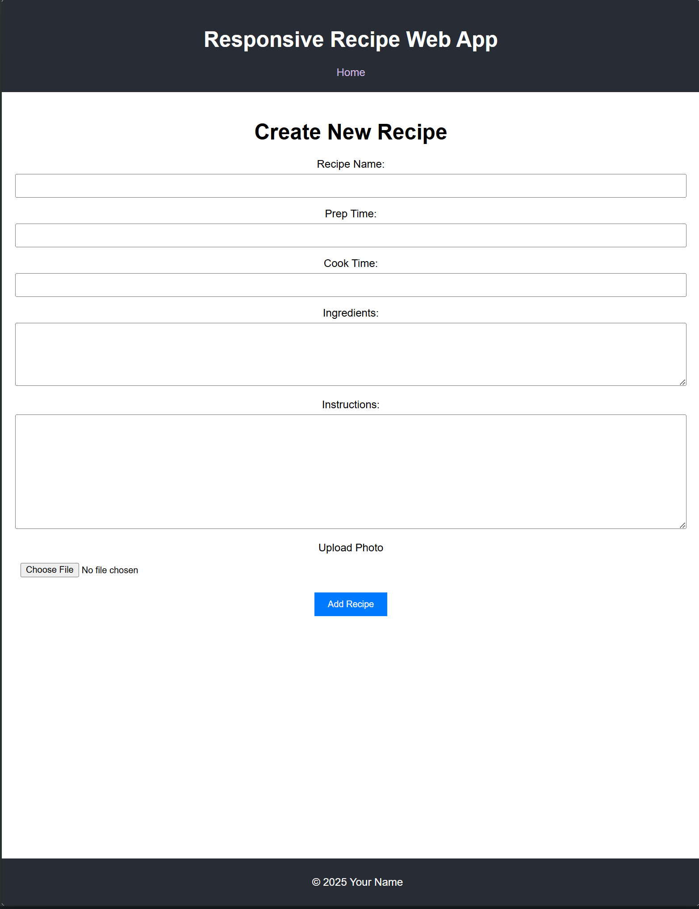

# Recipe Management Application (Work in Progress)

## Current Status
This is a partially working implementation. Users can:
- Create recipes (with some limitations)
- View recipe list
- Basic image upload functionality
- Store recipes in MongoDB database

Known limitations:
- Recipe editing needs work
- Time formatting issues exist
- Image handling is basic
- Some backend integration issues remain

## Progress Screenshots




## Prerequisites
- Node.js and npm ([Download](https://nodejs.org/))
- MongoDB Community Server ([Download](https://www.mongodb.com/try/download/community))
- Git ([Download](https://git-scm.com/downloads))

## Setup Instructions

### 1. Backend Setup

1. Open terminal and navigate to the Schema directory:
   ```powershell
   cd "path-to-project\1-2_Group10_FrontendUI\Schema"
   ```

2. Install backend dependencies:
   ```powershell
   npm init -y
   npm install express mongoose cors dotenv body-parser
   ```

3. Start MongoDB (Run PowerShell as Administrator):
   ```powershell
   net start MongoDB
   ```

4. Start the backend server:
   ```powershell
   node backend.js
   ```

### 2. Frontend Setup

1. Open a new terminal and navigate to the frontend directory:
   ```powershell
   cd "path-to-project\1-2_Group10_FrontendUI\responsive-recipe-website"
   ```

2. Install frontend dependencies:
   ```powershell
   npm install
   ```

3. Start development server:
   ```powershell
   npm run dev
   ```

## Features
- Create and view recipes
- Add ingredients and instructions
- Upload recipe images
- Track preparation and cooking times

## Testing the Integration

1. Create a Recipe:
   - Navigate to http://localhost:5173
   - Click "Create New Recipe"
   - Fill out the form (note: time fields may have formatting issues)
   - Submit the form
   - Check console for successful creation message

2. View Recipes:
   - Return to home page
   - Recently added recipes should appear
   - Click on a recipe to view details

3. Verify Database:
   ```powershell
   mongosh
   use recipe_db
   db.recipes.find()
   ```

## Development Notes

### Starting the Application

1. Start MongoDB (Run PowerShell as Administrator):
   ```powershell
   net start MongoDB
   ```

2. Start Backend (in Schema directory):
   ```powershell
   node backend.js
   ```

3. Start Frontend (in responsive-recipe-website directory):
   ```powershell
   npm run dev
   ```

4. Access the application at: http://localhost:5173

### Database Management
Clear recipe database:
```powershell
mongosh
use recipe_db
db.recipes.deleteMany({})
```

### Troubleshooting

### Common Issues

1. Database Connection:
   ```powershell
   # If MongoDB won't start
   "C:\Program Files\MongoDB\Server\7.0\bin\mongod.exe" --dbpath="c:\data\db"
   ```

2. Clear Test Data:
   ```powershell
   mongosh
   use recipe_db
   db.recipes.deleteMany({})
   ```

3. Port Conflicts:
   ```powershell
   # Check if ports are in use
   netstat -ano | findstr :5000
   netstat -ano | findstr :5173
   ```

### Known Bugs
- Time fields may show "undefined minutes"
- Image upload occasionally fails
- Recipe updates may not reflect immediately
- Frontend/Backend synchronization delays

## Next Steps
- Fix time formatting issues
- Improve error handling
- Enhance image upload functionality
- Complete recipe editing feature
- Add form validation
